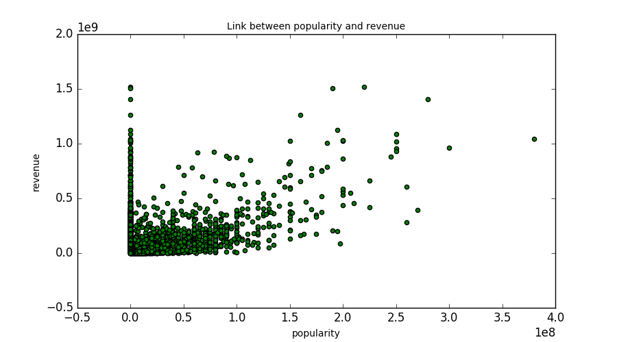
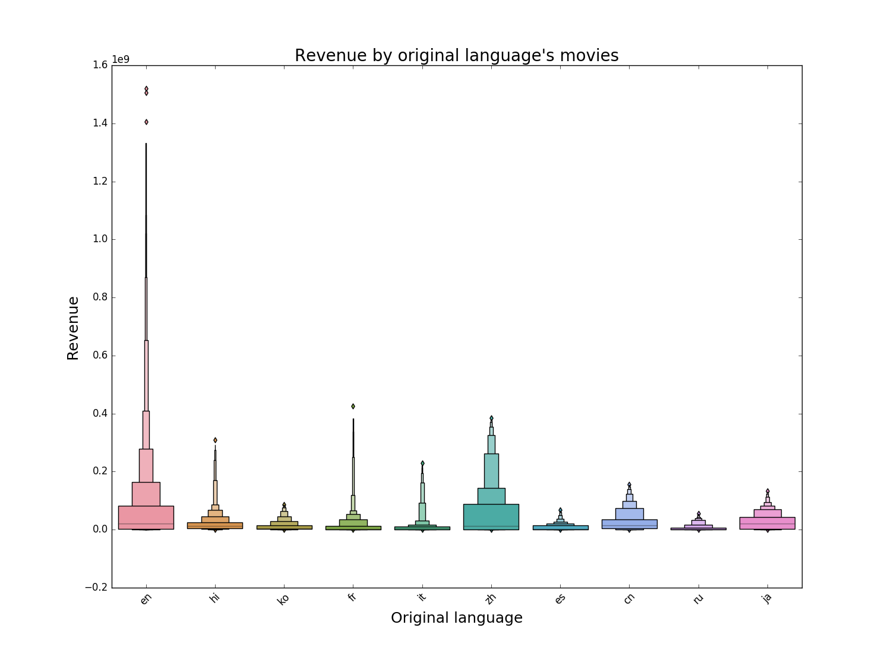
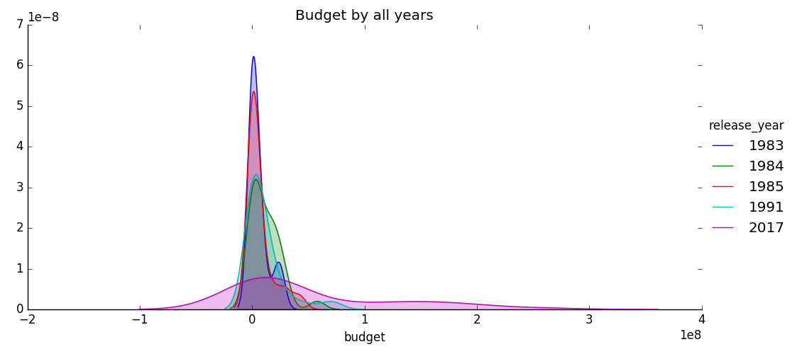
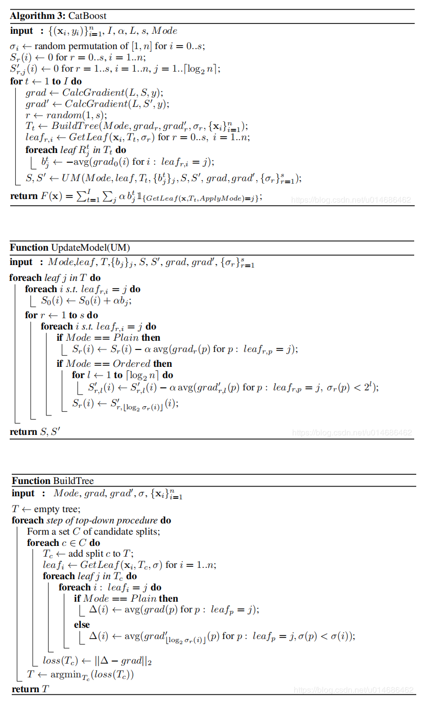
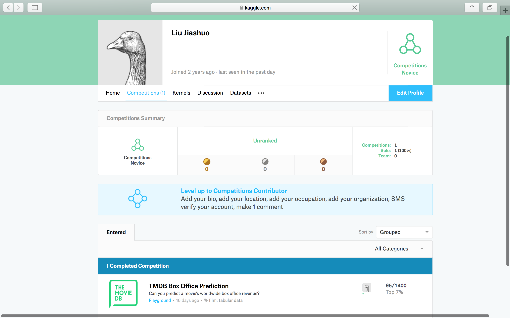
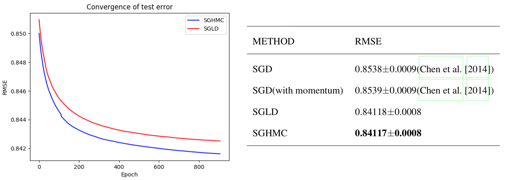

# 电影数据分析
> 刘家硕 计63 2016011286


## 一、实验概述

### 1. 实验目标
本项目希望基于电影数据集，依据电影的简介、关键词、预算、票房、用户评分等特征来对电影进行分析，并完成以下任务：

* 对电影特征的可视化分析
* 对电影票房的预测
* 多功能个性化的电影推荐算法

### 2. 数据集
* 针对票房预测部分，本项目使用了收集自<a href= 'https://www.themoviedb.org/'> The Movie Database(TMDB)</a>数据集的7398条电影信息, 包含了id、预算、电影主页、票房、语言、时长、评分、受欢迎度等特征，全部数据可见于<a href='https://www.kaggle.com/c/tmdb-box-office-prediction/data'>Kaggle TMDB Box Office Prediction</a>中。
* 针对电影推荐部分，本项目使用了收集自<a href= 'https://www.themoviedb.org/'> The Movie Database(TMDB)</a>数据集的TMDB5000数据集以及收集自电影数据集<a href='http://files.grouplens.org/datasets/movielens/ml-latest-small.zip'>MovieLens</a>的部分数据，包含了id、预算、内容简介、关键词等特征，并且包含了用户对电影的评分矩阵，全部数据可见于<a href='https://github.com/LJSthu/Movie-Analysis/tree/master/data'>LJSthu(github)</a>中。

### 3. 实验完成情况
* 完成了对电影特征的可视化分析。
* 完成了基于电影特征的电影票房预测算法，并在Kaggle的TMDB Box Office Prediction比赛中最终取得了前 6.8%（95/1400）的成绩。
* 完成了基于简单特征（内容、评分、关键词）的三种推荐算法、基于KNN的两种协同过滤算法、基于奇异值分解的推荐算法以及三种集成推荐算法，共设计并实现了九种电影推荐算法。


## 二、电影特征的可视化分析
本项目中，我首先对电影数据的一些特征进行了可视化分析，来为之后的票房预测和电影推荐做帮助。

* 首先我分别绘制了票房与预算、欢迎程度（popularity）、戏剧性程度（theatrical）的关系图，如下图所示：




* 从图中可以看出，这三个特征与票房之间存在着比较强的相关关系，于是我选取了票房、预算、受欢迎程度、戏剧性、放映时间、id、上映年份7个特征，绘制了它们之间的相关关系图，如下图所示：


* 图中颜色越深代表相关关系越强，可以看出电影票房与预算、受欢迎程度、戏剧性三个特征有着很强的相关关系，而与上映时间、id等信息几乎没有相关关系，这也十分符合我们的预期。
* 我还研究了电影语言与票房的关系，如下图所示：


* 最后我探究了电影预算与电影上映年份之间的关系，为了突出区别，我选取了1983、1984、1985、1991、2017五个年份的电影预算来进行密度估计，结果如图所示：


* 从图中可以看出上映年份对预算的分布影响比较大，较早的年份预算集中于比较低的部分，而越靠近现在，电影的预算分布相对越均匀，对应着越来越多的大制作电影，这里我认为上映年份这个特征对票房的影响主要是通过对预算的影响来体现的。
* 备注：这部分代码参见<a href='https://github.com/LJSthu/Movie-Analysis/tree/master/FeatureEDA'> LJSthu(github)</a>


## 三、电影票房预测

### 1. Data Augmentation
* 首先我对提供的数据进行了处理与清洗
* 加入了一些额外的电影数据，包括电影上映日期、评分、受欢迎度等（全部使用的数据集参见<a href='https://github.com/LJSthu/Movie-Analysis/tree/master/data/prediction'>LJSthu</a>）
* 最终使用的特征包括了电影名称、发行公司、受欢迎程度、戏剧性程度、评分人数、评分、放映时长、预算等。
* 对全部数据进行5折划分来进行5-折交叉验证。

### 2. 算法说明
* 本次比赛中我主要使用了三种算法来进行预测，分别为catboost、XGBoost、LightGBM
* 最终的结果为这三种算法的指数加权平均

#### 2.1 XGBoost
* 首先尝试了使用XGBoost算法来进行预测
* 常用算法便不描述具体过程了

#### 2.2 lightGBM
* 在XGBoost的基础上，lightGBM使用了histogram算法，同时优化了对类别特征的支持，可以进行分布式训练，极大的提升了训练速度。相比于XGBoost, 在准确率相近的情况下，速度大大加快。


#### 2.3 CatBoost
* CatBoost中使用了梯度提升(Gradient Boost)与类别型特征(Categorical Features)，基于梯度提升决策树。
* 使用对称树结构来避免过拟合问题，并且用特殊的方式处理categorical features。
* 算法的总流程伪代码如下所示（使用原论文中的伪代码）



### 3. 实验结果
* 最终我将三个模型的输出进行了指数加权，即最终的输出为：

$$
weight = exp(w_1 * cat + w_2 * xgb + w_3 * lgbm)
$$
其中
$$
w_1 + w_2 + w_3 = 1.0
$$

* 最终的排名为95/1400（top 7%）


## 四、电影推荐算法
这里将分别介绍我实现的九种电影推荐算法。

### 1. 基于人口统计学的推荐
* 这里我实现了一个基于评分的推荐算法,对每部电影计算评分如下：
$$score = \frac{v}{v+m}*r + \frac{m}{m+v}*c$$
其中$v$为当前电影的投票数目，$m$为所有电影的平均投票数目，$r$为当前电影的平均等级，$c$为所有电影的平均等级
* 算法为用户推荐评分最高的10部电影。

```
结果示例：
title       									score
The Shawshank Redemption          				8.059258
Fight Club          							7.939256
The Dark Knight         						7.920020
Pulp Fiction          							7.904645
Inception         								7.863239
The Godfather          							7.851236
Interstellar         							7.809479
Forrest Gump         							7.803188
The Lord of the Rings: The Return of the King   7.727243
The Empire Strikes Back          				7.697884

```


### 2. 基于内容的推荐算法
* 这里我实现了两种简单的推荐算法，相关代码参见<a href='https://github.com/LJSthu/Movie-Analysis/tree/master/naive_recommender'> LJSthu(github)</a>

#### （1）基于电影简介文本的推荐算法
* 首先将电影数据中的简介文本通过sklearn中的`TfidfVectorizer`,将简介文本变成向量，并使用`cosine`距离来度量向量之间的相似度。
* 用户输入一个电影名字，算法推荐与之最相近的10部电影。

 ```
 结果示例：
 - 输入： The Dark Knight Rises
 - 输出： The Dark Knight					
			Batman Forever
			Batman Returns
			Batman
			Batman: The Dark Knight Returns, Part 2
			Batman Begins
			Slow Burn
			Batman v Superman: Dawn of Justice
			JFK
			Batman & Robin

 
 ```
* 从结果可以看出，推荐的电影内容与输入电影十分相近，符合算法设计的初衷。 

#### （2）基于电影内容的推荐算法
* 这里我利用了电影中的关键词、类型、导演、演员等信息
* 首先使用sklearn中的`CountVectorizer`将文本转换为词频矩阵，之后利用`cosine`距离来度量电影之间的相似度，与（1）算法很类似。
* 用户输入一个电影名字，算法推荐与之最相近的10部电影。
 
 ```
 结果示例：
 - 输入： The Dark Knight Rises
 - 输出： The Dark Knight
			Batman Begins
			Amidst the Devil's Wings
			The Prestige
			Romeo Is Bleeding
			Black November
			Takers
			Faster
			Catwoman
			Gangster Squad


 
 ```

### 3. 基于KNN的协同过滤算法
* 这里我实现了两种基于KNN的协同过滤算法，代码可见<a href='https://github.com/LJSthu/Movie-Analysis/tree/master/personal_recommender'>LJSthu</a>
* 这里我使用了`MovieLen`数据集中的用户对电影的评分矩阵

#### （1）针对电影相似度的推荐算法
* 这里我将全部的用户对某一电影的评分作为该电影的特征向量，使用`KNN`算法，对于用户输入的电影，选出与之最相似的十部电影进行推荐

```
结果示例：
- 输入： Avengers: Infinity War - Part I (2018)
- 输出： Thor: Ragnarok (2017)
		Captain America: Civil War (2016)
		Deadpool 2 (2018)
		Doctor Strange (2016)
		Guardians of the Galaxy 2 (2017)
		Iron Man (2008)
		Untitled Spider-Man Reboot (2017)
		Avengers, The (2012)
		Inception (2010)
		Logan (2017)

```
* 可以看到，输入的电影为《复仇者联盟三》,推荐的十部电影中有九部为漫威出品的超级英雄电影，另外一部也是科幻大片，可见这种衡量电影之间相似性的方法是十分有效的。


#### （2）针对用户相似度的推荐算法
* 之前的推荐算法大多基于电影之间的相似度来进行推荐，但对于不同的用户，推荐的结果并没有任何不同，没有实现对于不同用户的个性化推荐，当前的算法就是为了解决这样的问题。
* 这里我将一个用户对于全部电影的评分作为该用户的特征向量，使用`KNN`算法，对于输入的用户ID
	* 首先选出10个与当前用户最相似的10个用户
	* 之后选出这10个最相似用户看过的且当前用户没有看过的电影
	* 最后在这些电影中选择出 平均评分最高的十部，推荐给用户

```
结果示例：
- 输入：用户id=2
- 输出： Forrest Gump (1994)
		Pulp Fiction (1994)
		Silence of the Lambs, The (1991)
		Matrix, The (1999)
		Donnie Darko (2001)
		
- 输入：用户id=6
- 输出： Beverly Hills Cop III (1994)
		Demolition Man (1993)
		Quiz Show (1994)
		Drop Zone (1994)
		Home Alone (1990)
```
* 可以看到对于不同的用户，得到的推荐结果是互不相同的，做到了对用户个性化的推荐。
* **测试结果**
	* 我将用户评分矩阵的85%用来训练，15%用作测试，具体划分方法为：对每个用户对每个电影的评分，生成一个随机数，若大于0.85，则为测试；小于等于0.85，则为训练
	* 使用本方法对每个用户推荐了10部电影，总共推荐了6040部电影，其中出现在测试集中的电影数目为**878**部，占**14.54%**


### 4. 基于奇异值分解的推荐算法
* 这里我实现了基于SVD分解的推荐算法，通过对用户-电影评分矩阵进行SVD分解，对用户未评分的电影预测评分。
* 这里我主要希望将这个算法作为一个二级筛选方法，即对于输入的用户id与一系列电影id，去预测出当前用户对于这一系列电影的评分，从中挑选出评分最高的10部进行推荐。
* 由于用户-电影评分矩阵是维度很高的系数矩阵，于是我使用了不同的算法来进行分解，包含了
	* 随机梯度下降算法(SGD)
	* 朗之万动态系统随机梯度方法(SGLD)
	* 随机梯度哈密顿蒙特卡洛方法(SGHMC)
* 其中SGD为基于优化的方法，而SGLD与SGHMC为基于采样的贝叶斯概率矩阵分解算法。我在`movielen`数据集的`mk-1m`中进行了5-折交叉验证，最后的结果如图所示：

* 从图中可以看出，SGHMC算法的RMSE loss最低，达到了0.84117，是一种比较好的优化方法，得到的模型也具有比较好的推荐效果。

### 5. 集成推荐算法
* 上述的推荐算法均为针对某一个方面进行推荐，并且没有实现对特定用户输入的特定电影进行推荐，这里我将上面的算法组合起来，实现了三种集成推荐算法，可以进行更加个性化的推荐。

#### 5.1 KNN+文本的集成推荐
* 我首先使用KNN算法对输入的当前用户ID，查找与之最邻近的10位用户，将这些相似用户看过的电影并且当前用户没有看过的电影作为候选电影。
* 之后将用户输入的文本转换为向量，将候选电影的文本信息（简介、名称、导演等）编码为向量。
* 最后依据提取的候选电影向量与输入文本向量之间的`cosine`距离来为用户推荐距离最近的前10部电影。


#### 5.2 用户KNN+电影KNN
* 我首先使用KNN算法对输入的当前用户ID，查找与之最邻近的10位用户，将这些相似用户看过的电影并且当前用户没有看过的电影作为候选电影。
* 之后对于电影数据进行KNN处理，挑选出与用户输入电影最邻近的10部电影进行推荐


#### 5.3 用户KNN+奇异值分解
* 我首先使用KNN算法对输入的当前用户ID，查找与之最邻近的10位用户，将这些相似用户看过的电影并且当前用户没有看过的电影作为候选电影。
* 之后利用矩阵分解，模拟当前用户对候选电影的评分，选择评分最高的十部电影进行推荐。
* **测试结果**
	* 这里采用了与3.2中相同的测试方法进行测试
	* 对每个用户推荐了10部电影，总共推荐了6040部电影，其中出现在测试集中的电影数目为**602**部，占**9.97%**，效果不如只使用用户KNN的算法
* **分析原因**
	* 用户、电影评分矩阵中包含了对于每部电影的评分，评分有高有低，即使是用户看过的电影也会有评分很低的，在本方法中会将这样的电影排除掉，为用户推荐的是模拟评分后分数高的电影
	* 测试中没有涉及到这个问题，因此带来了结果的差异

	

## 五、总结
* 本项目从收集数据集、分析用户需求，到论文的查阅、算法的实现，最后到推荐系统的构建，一步步地完成了一个小型（微型）机器学习系统的搭建，将课上的知识学以致用，增强了从较大的方面分析问题的能力。
